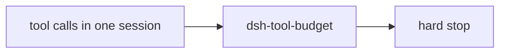

# dsh-tool-budget

DeepSeek Harness plugin: **hard-stop** tool use after a **per-session** call budget.

Pairs with [dsh-repeat-stop](https://github.com/173787247/dsh-repeat-stop). Part of **[dsh-wsl-kit](https://github.com/173787247/dsh-wsl-kit)**.

[中文说明 → README.zh.md](./README.zh.md)

## Where it sits

Hard-stops tool use after a per-session budget. Identical-call loops are dsh-repeat-stop.



Suite diagram and version snapshot: [dsh-wsl-kit](https://github.com/173787247/dsh-wsl-kit#how-the-pieces-fit). This plugin is **0.1.2** (daily). Do not copy that matrix into this README.


---
## Compatibility

| Field | Value |
|-------|-------|
| **Plugin** | `dsh-tool-budget` **0.1.2** |
| **Minimum dsh** | ≥ **0.1.2** (web UI one-shot `?token=` on Windows relay `:3081`) |
| **Latest verified** | See [dsh-wsl-kit Compatibility](https://github.com/173787247/dsh-wsl-kit#compatibility-2026-09) (currently **`0.1.5-rc.1`**) — single source of truth for the suite |
| **Kit set** | `daily` (also in `github` / `full`; fetch+net also in `llm`) |
| **Cloud Flash** | Use model id **`deepseek-flash`** (V4.1 Flash) in `~/.dsh/settings.yaml` / `llm-deepseek` — not configured by this plugin |
| **Agent Teams** | Upstream experimental; not required here |

Suite floor versions: kit [`check-plugin-versions.sh`](https://github.com/173787247/dsh-wsl-kit/blob/master/scripts/check-plugin-versions.sh). Fault tree: [TROUBLESHOOTING.md](https://github.com/173787247/dsh-wsl-kit/blob/master/docs/TROUBLESHOOTING.md).

## Why

Repeat-stop catches identical spam. Budget catches “many different tools forever” in one session—useful when long WSL tasks burn API quota.

Default: **80** tracked calls allowed; the **81st** is denied. Job status tools are excluded by default.

This is a **safety rail**, not a product license limit. Raise `maxCalls` or disable if it feels tight.

## Install

```sh
dsh plugin --profile web add github:173787247/dsh-tool-budget
```

Restart `dsh web`. No new tool. Blocks show as `dsh-tool-budget: blocked` in Trajectory.

## Config

```yaml
- id: dsh-tool-budget
  name: dsh-tool-budget
  config:
    enabled: true
    maxCalls: 80
    exclude:
      - job_output
      - job_list
      - job_kill
    # include: []   # if set, only these names count
```

| Key | Default | Meaning |
|-----|---------|---------|
| `enabled` | `true` | Master switch |
| `maxCalls` | `80` | Allowed tracked calls per session |
| `exclude` | job_* | Names that do not count |
| `include` | (empty) | If set, only these names count |

## vs dsh-repeat-stop

| Plugin | What it blocks |
|--------|----------------|
| `dsh-repeat-stop` | Consecutive identical calls |
| `dsh-tool-budget` | Total tool calls in the whole session |

## Test

```sh
npm test
```

## FAQ

**Does this replace dsh-repeat-stop?** No. Repeat-stop blocks identical streaks; this caps total calls per session.

**Will it block job_* tools?** Not by default — they are excluded so long-running shell jobs can still be observed.

**How do I raise the limit?** Set `config.maxCalls` in your profile `cordis.patch.yml` and restart `dsh web`.

## License

MIT
